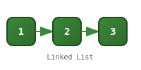

<div align="center">


# linked-list-3bb82a07

[](https://nodejs.org)
[](LICENSE)
[](https://developer.mozilla.org/en-US/docs/Web/JavaScript)

</div>

A minimal, zero-dependency **singly linked list** implementation in JavaScript using ES6 classes and modules.

> A linked list is a linear data structure where each element (node) contains a value and a pointer to the next node. Unlike arrays, linked lists offer O(1) insertions at the head and tail, making them ideal for queue and stack patterns.

## Features

- **Full CRUD operations** — append, prepend, insert at index, remove at index
- **O(1) head/tail operations** — constant-time access to both ends
- **Search utilities** — find values, check containment, access by index
- **String representation** — pretty-print the list with `toString()`
- **Zero dependencies** — pure JavaScript, no runtime requirements
- **ES module** — `import` syntax ready

## Installation

Clone the repository:

```bash
git clone git@github.com:Kazumi500/linked-list-3bb82a07.git
cd linked-list-3bb82a07
```

No install step needed — the project has zero dependencies.

## Usage

```js
import LinkedList from './LinkedList.js';

const list = new LinkedList();

list.append('dog');
list.append('cat');
list.append('parrot');
list.append('hamster');
list.append('snake');
list.append('turtle');

console.log(list.toString());
// ( dog ) -> ( cat ) -> ( parrot ) -> ( hamster ) -> ( snake ) -> ( turtle ) -> null

console.log(list.size());    // 6
console.log(list.head());    // 'dog'
console.log(list.tail());    // 'turtle'
console.log(list.at(2));     // 'parrot'
console.log(list.contains('cat'));  // true
console.log(list.findIndex('snake')); // 4

list.prepend('axolotl');
console.log(list.toString());
// ( axolotl ) -> ( dog ) -> ( cat ) -> ( parrot ) -> ( hamster ) -> ( snake ) -> ( turtle ) -> null

const removed = list.pop();
console.log(removed);   // 'axolotl'

list.insertAt(2, 'ferret', 'gecko');
console.log(list.toString());
// ( dog ) -> ( cat ) -> ( ferret ) -> ( gecko ) -> ( parrot ) -> ( hamster ) -> ( snake ) -> ( turtle ) -> null

list.removeAt(4);
console.log(list.toString());
// ( dog ) -> ( cat ) -> ( ferret ) -> ( gecko ) -> ( hamster ) -> ( snake ) -> ( turtle ) -> null
```

Run the example:

```bash
node main.js
```

## API

### `new LinkedList()`

Creates an empty linked list.

### `append(value)`

Adds a node with the given `value` to the end of the list. O(1).

### `prepend(value)`

Adds a node with the given `value` to the start of the list. O(1).

### `size()` → `number`

Returns the total number of nodes in the list. O(1).

### `head()` → `value | undefined`

Returns the value of the first node. Returns `undefined` if the list is empty.

### `tail()` → `value | undefined`

Returns the value of the last node. Returns `undefined` if the list is empty.

### `at(index)` → `value | undefined`

Returns the value of the node at the given `index` (0-based). Returns `undefined` if no node exists at that index.

### `pop()` → `value | undefined`

Removes the head node and returns its value. Returns `undefined` if the list is empty.

### `contains(value)` → `boolean`

Returns `true` if any node in the list has the given `value`, otherwise `false`.

### `findIndex(value)` → `number`

Returns the index of the first node with the given `value`. Returns `-1` if the value is not found.

### `toString()` → `string`

Returns a string representation of the list in the format:

```
( value1 ) -> ( value2 ) -> ( value3 ) -> null
```

Returns an empty string if the list is empty.

### `insertAt(index, ...values)`

Inserts one or more new nodes with the given values at the specified `index`.

> [!NOTE]
> Throws a `RangeError` if `index` is below 0 or above the list's size.

```js
list.insertAt(1, 'a', 'b', 'c');
```

### `removeAt(index)` → `value`

Removes the node at the given `index` and returns its value.

> [!NOTE]
> Throws a `RangeError` if `index` is below 0 or equal to or greater than the list's size.

## Project structure

```
linked-list-3bb82a07/
├── LinkedList.js    # LinkedList class with Node helper
├── main.js          # Example usage
├── package.json     # Project metadata
└── README.md        # This file
```

## Requirements

- [Node.js](https://nodejs.org/) 20 or later (for ES module support)
